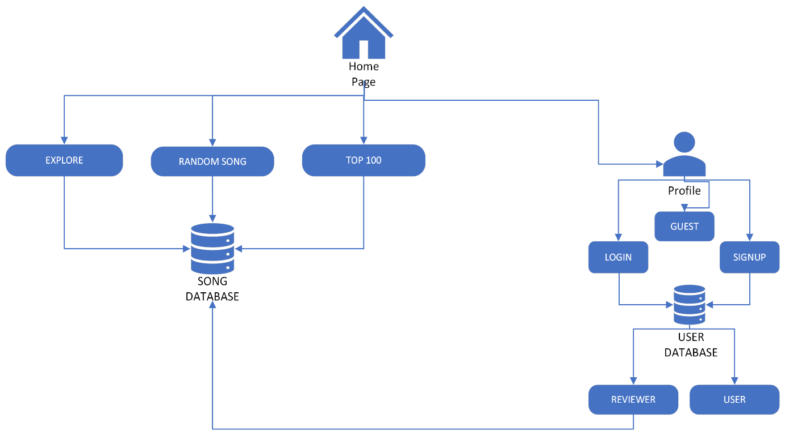
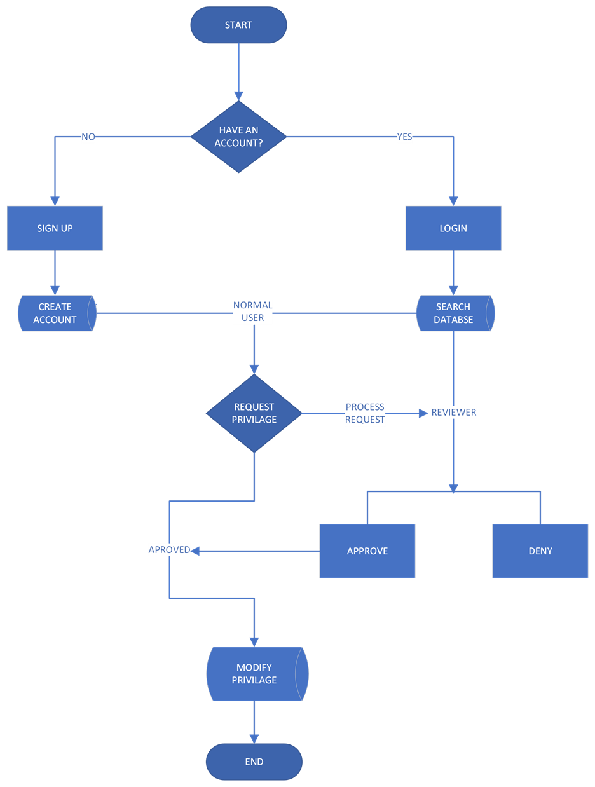

# REviewed

## Motivație

&nbsp;Muzica este un domeniu vast și nu există multe website-uri cu review-uri făcute de utilizatori și pentru utilizatori. Majoritatea website-urilor care se focusează perecenzii de muzică se focusează doar pe partea de recenzie acriticilor, nu pe cea a utilizatorului de rând care are, adesea, gusturi total diferite.

## Descriere

&nbsp;Proiectul este un website dedicat muzicii. Acesta are mai multe secțiuni pentru a vizualiza diferite melodii sau albume, pentru a aflainformații despre acestea și pentru a putea consulta clasamentele cu
cele mai bune melodii. De asemenea, utilizatorul poate căuta melodii specifice pentru a le oferi o notă iar în cazul în care nu știe ce să asculte poate să descopere o melodie/album nou recomandat la întâmplare de website. Utilizatorii sunt împărțiți în două categorii: utilizator normal și cei care pot să realizeze recenzii și să publice o melodie nouă. De asemenea “revieweri” au posibilitatea de a accepta cererile
utilizatorilor normali pentru a putea deveni la rândul lor “revieweri”.

 <b>Detalii melodie/albume:</b>

 
  <ul>
    <li> Nume melodie/albume </li>
    <li> Artist </li>
    <li> Gen muzical </li>
    <li> Anul lansării </li>
    <li> Popularitate </li>
    <li> Rating utilizatori </li>
  </ul>

<b>Detalii recenzii:</b>

 
  <ul>
    <li> Nume utilizator </li>
    <li> Rating acordat </li>
  </ul>

## Audiența țintă

Utilizatorii “Reviewed” nu se restrâng doar la utilizatorii derând. Website-ul are conturi speciale pentru critici de muzică, carepot să descrie și să voteze la rândul lor melodiile preferate.
”REviewed” nu se adresează tuturor: oamenilor de rând care vor săvadă clasamentele de melodii, pasionaților de muzică care vor să descopere melodii noi și criticilor care doresc să contribuie la ratingul melodiilor.

## Funcționalități și proceses

&nbsp;Aplicația oferă numeroase funcționalități precum:

<ul>
  <li>Postarea melodiilor.</li>
  <li>Înregistrare și autentificare prin protecția împotriva username-urilor duplicate.</li>
  <li>Existența diferitelor roluri pentru utilizatori.</li>
  <li>Posibilitatea schimbării rolurilor prin cereri ce pot fi aprobate.</li>
	<li>Trimiterea notificărilor legate de notăți prin mail-uri automate.</li>
	<li>Existența unui chestionar prin care utilizatorii își pot evalua cunoștiințele legate de cultura muzicala.</li>
	<li>Funcția de sugestie a unei melodii neascultate de utilizator prin intermediul recomandărilor din baza de date.</li>
	<li>Aspectul diferit pentru fiecare dimensiune a ecranului pentru păstrarea unui aspect uniform pe orice device(responsive).</li>
</ul>

## Tehnologii utilizate

<ul>
<li>&nbsp;Limbaje de nivel înalt precum <b>HTML(front end)</b> și <b>CSS(front end)</b> prin care au fost realizate structura și stilizate paginile principale.
<b>Javascript</b>(front end, utilizat pentru realizarea animaților și pentru creearea și apariția dinamică a erorilor pe paginile de login și sign up), <b>PHP</b>(back end, utilizat pentru procesele de login și afișare a melodiilor), <b>MySQL</b>(back end unde se vor reține date legate deutilizatori și melodii) precum și framework-uri și librării ce îmbunătățesc calitatea produsului și viteza în realizarea acestuia precum <b>Bootstrap</b>(front end, pentru ușurarea muncii pentru crearea paginilor și stilizării).</li>
<li>&nbsp;De asemenea sunt utilizate tehnologii pentru email automation precum <b>PHPMailer</b> pentru a anunța utilizatorii de noi modificări
aduse website-ului.</li>
<li> &nbsp;Bazele de date sunt realizate în <b>MySQL</b> utilizând un host pe calculatorul personal prin intermediul aplicației <b>XAMPP</b> și <b>PhpMyAdmin</b>.
Acestea sunt împărțite în tabele distincte atât pentru melodii cât șipentru utilizatori. Bazele de date sunt împărțite în tabele de
utilizatori în care sunt stocate date precum parole, username, email și rolul fiecarui utilizator și o tabelă care va reține titlurile melodiilor și descrieriile.</li>
</ul>

## Arhitectura

&nbsp;Arhitectura proiectului este bazată pe **microservicii**, fiind oferite utilizatorilor numeroase funcțioanlități precum modificarea angajaților și căutarea acestora. De asemenea, proiectul are o arhitectură **modulară** codul sursă fiind împărțit în blocuri de dimensiuni reduse de cod pentru modificarea cu ușurință a acestora.

&nbsp;**Prima imagine** reprezinta o diagramă generală a proiectului și a fiecărei pagini.

&nbsp;**A doua imagine** fluxul de date și comunicarea acestora cu baza de date.
